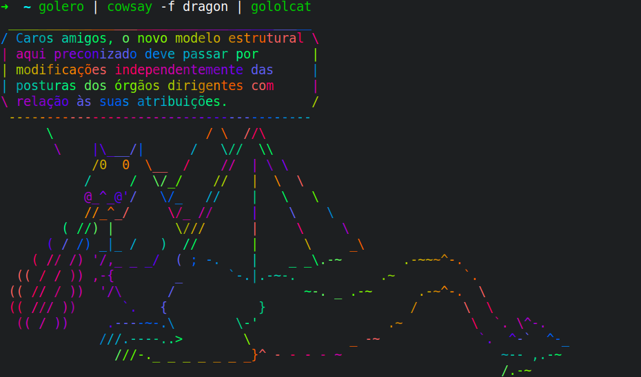

# gololcat



Based on the tutorial [Build a Command Line app with Go: lolcat](https://flaviocopes.com/go-tutorial-lolcat/) by [Flavio Copes](https://flaviocopes.com/).

### Installation

You need `go` installed and `GOBIN` in your `PATH`. Once that is done, run the
command:

```shell
$ go get -u github.com/thiamsantos/gololcat
```

## Usage

```sh
$ gololcat
```
